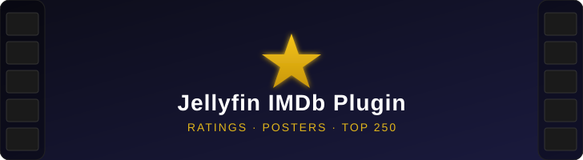

# Jellyfin IMDb Plugin

<p align="center">
  
</p>

<p align="center">
  
  
  
</p>

A Jellyfin plugin that replaces community ratings with real IMDb scores and automatically maintains an **IMDb Top 250** playlist in your library.

## Features

- **IMDb Ratings** — Scheduled task that updates the community rating for every movie in your library with the actual IMDb score (via the [OMDb API](https://www.omdbapi.com))
- **IMDb Poster Provider** — Remote image provider that makes IMDb/OMDb posters available alongside your existing providers
- **Top 250 Playlist** — Automatically creates and maintains an "IMDb Top 250" playlist ordered by the live IMDb chart — no scripts or cron jobs required

## Installation

### From Plugin Repository (recommended)

1. Go to **Dashboard → Plugins → Repositories**
2. Click **+** and add:
   - **Name:** `IMDb Plugin`
   - **URL:**
     ```
     https://raw.githubusercontent.com/jpedrofontes/jellyfin-imdb-plugin/main/manifest.json
     ```
3. Go to **Catalog** → find **IMDb Ratings & Top 250** → click **Install**
4. Restart Jellyfin

### Manual

1. Download the latest `.zip` from [Releases](https://github.com/jpedrofontes/jellyfin-imdb-plugin/releases)
2. Extract it into your Jellyfin plugins directory:
   ```
   <jellyfin-data>/plugins/IMDb/Jellyfin.Plugin.ImdbRatings.dll
   ```
3. Restart Jellyfin

## Configuration

After installing, go to **Dashboard → Plugins → IMDb**:

| Setting | Description |
|---------|-------------|
| **OMDb API Key** | Required. Get a free key at [omdbapi.com](https://www.omdbapi.com/apikey.aspx) (1,000 req/day). |
| **User ID** | The Jellyfin user ID for the Top 250 playlist. Found in the URL when you click a user in Dashboard → Users. |
| **Enable Ratings Task** | Toggle the scheduled IMDb ratings sync on/off. |
| **Enable Playlist Task** | Toggle the Top 250 playlist sync on/off. |
| **Chart Cache (hours)** | How long to cache the IMDb chart before re-fetching (default: 24h). |

The Top 250 playlist is automatically found by name or created on the first run — no manual setup needed.

## How It Works

### Ratings
The plugin runs a scheduled task (daily at 3:30 AM by default) that iterates over every movie in your library, looks up its IMDb ID, and fetches the current rating from OMDb. Movies without an IMDb ID are skipped.

### Top 250 Playlist
Every 6 hours (by default), the plugin fetches the current IMDb Top 250 chart, matches the titles to movies in your library, and reorders the playlist to reflect the live chart. If you don't have all 250 movies, it includes whichever ones you do have in the correct order.

## Building from Source

```bash
dotnet build src/Jellyfin.Plugin.ImdbRatings.csproj -c Release -o ./output
```

The compiled DLL will be at `output/Jellyfin.Plugin.ImdbRatings.dll`.

## License

[MIT](LICENSE)
